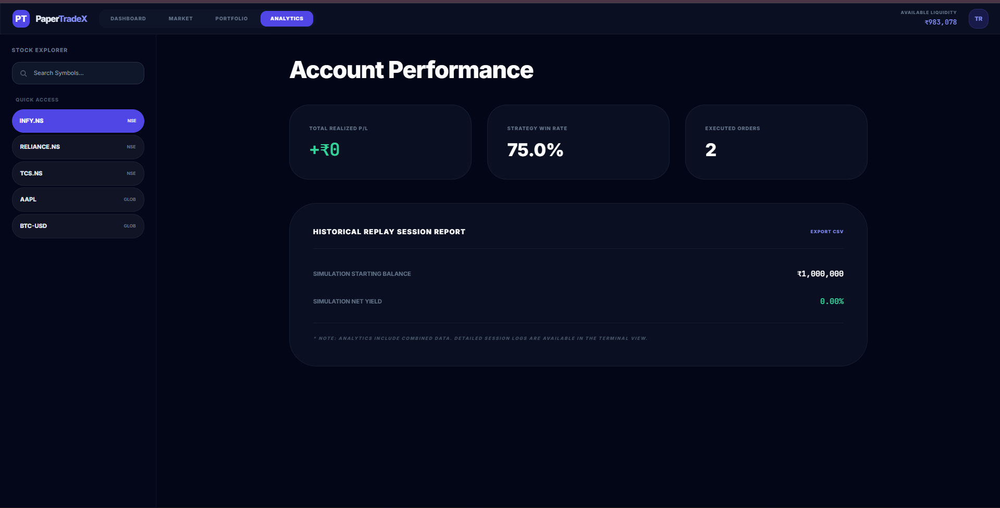
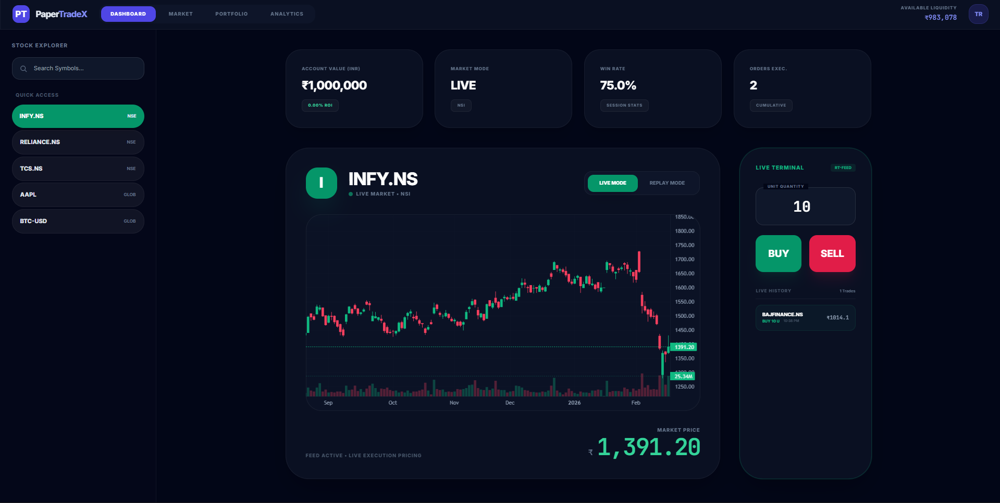
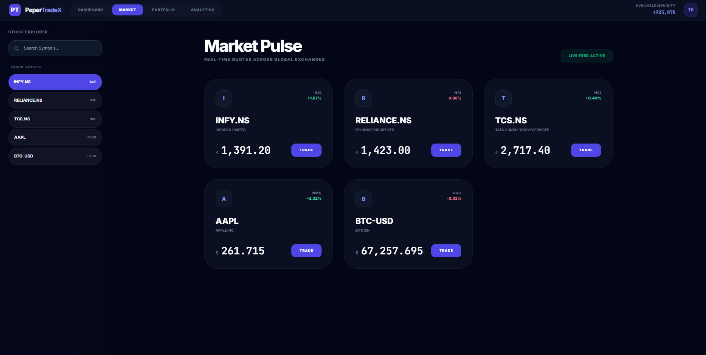
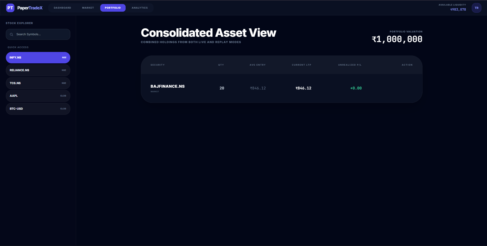

# PaperTradeX | Advanced Paper Trading Platform

PaperTradeX is a high-performance, full-stack interactive paper trading environment. It empowers traders to practice strategies using real-time market streaming and a high-fidelity 2-year historical replay engine.


## Analysis Feature


## Live Mode


## Marketplace


## Portfolio


## Replay Mode

---

## 🏛 Production Architecture

PaperTradeX follows a modern decoupled architecture designed for scalability and performance:

### Frontend (Client-Side)
- **Framework**: React 18.3.1 with TypeScript.
- **Module System**: Browser-native ESM via `importmap` (No heavy bundling required for development).
- **Styling**: Tailwind CSS with a custom Glassmorphic design system.
- **Charting**: TradingView's Lightweight Charts (LWC) for high-performance financial data rendering.
- **State Management**: React Hooks (useMemo, useCallback) for optimized rendering of high-frequency data.

### Backend (Server-Side)
- **Runtime**: Node.js with TypeScript.
- **Web Framework**: Express.js (v5.x) providing a robust RESTful API.
- **Real-time Engine**: Socket.io for live data broadcasting and trade synchronization.
- **Database**: MongoDB (Mongoose ODM) for persistent storage of user profiles, portfolios, and trade history.
- **Market Interface**: Yahoo Finance integration with multi-proxy fallback logic to ensure maximum uptime.

---

## 🚀 Key Features

- **Dual-Mode Terminal**: Seamlessly switch between **Live Market** (Real-time) and **Historical Replay** (Backtesting).
- **High-Speed Replay**: Sequential bar-by-bar playback with variable speed controls (up to 20x).
- **Global Asset Search**: Instantly find and trade symbols across NSE, BSE, NYSE, and Crypto markets.
- **Consolidated Portfolio**: Unified view of holdings across different trading modes.
- **Advanced Analytics**: Real-time ROI, Win Rate, and detailed trade logging.

---

## 💻 Local Development Setup

Follow these steps to set up the full-stack environment on your local machine.

### Prerequisites
- **Node.js** (v18.0.0 or higher)
- **MongoDB** (Local installation or a free [MongoDB Atlas](https://www.mongodb.com/cloud/atlas) URI)
- **npm** (v9.0.0 or higher)

### 1. Backend Configuration
1. Navigate to the backend directory:
   ```bash
   cd backend
   ```
2. Install the production and development dependencies:
   ```bash
   npm install
   ```
3. Create a `.env` file in the `backend/` directory:
   ```env
   PORT=5000
   MONGO_URI=mongodb://localhost:27017/tradepulse
   JWT_SECRET=your_secure_random_string_here
   NODE_ENV=development
   ```
4. Start the backend in development mode (auto-reload enabled):
   ```bash
   npm run dev
   ```
   *The server will be live at `http://localhost:5000`.*

### 2. Frontend Configuration
The frontend uses browser-native ESM. You simply need to serve the root directory.
1. Return to the project root:
   ```bash
   cd ..
   ```
2. Start a local static server. You can use any tool (Live Server in VS Code, Python, etc.). Using `npx`:
   ```bash
   # Option A: Simple static server
   npx serve .
   
   # Option B: If you have Vite installed globally
   npx vite
   ```
3. Open the provided URL (typically `http://localhost:3000`) in your browser.

---

## 📂 Directory Structure

```text
├── components/             # Modular React components (Dashboard, Sidebar, Chart, etc.)
├── services/               # Frontend API client and Market Data logic
├── backend/                # Node.js / Express Source Code
│   ├── config/             # DB and Socket.io initializations
│   ├── controllers/        # Request handling logic
│   ├── middleware/         # Auth (JWT) and Error handling
│   ├── models/             # Mongoose Schemas (User, Trade, Portfolio)
│   ├── routes/             # Express Route definitions
│   └── services/           # Backend Market Data services (Yahoo Finance)
├── constants.tsx           # Application configuration and initial assets
├── types.ts                # Shared TypeScript Interfaces
├── index.html              # Entry point with ESM Import Maps
└── App.tsx                 # Main Application Orchestrator
```

## 🛡 Security & Environment
- **Authentication**: Uses JWT (JSON Web Tokens) for stateless security.
- **Passwords**: Encrypted using `bcryptjs` before being stored in MongoDB.
- **CORS**: Configured for secure cross-origin communication between the Frontend and Backend.

---
*Developed for professional traders and developers. PaperTradeX is a simulation environment for strategy testing.*