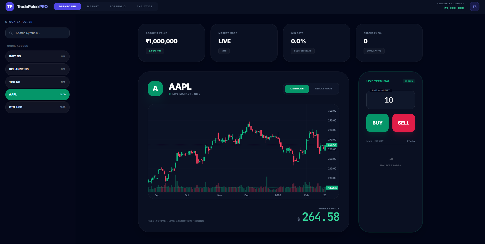
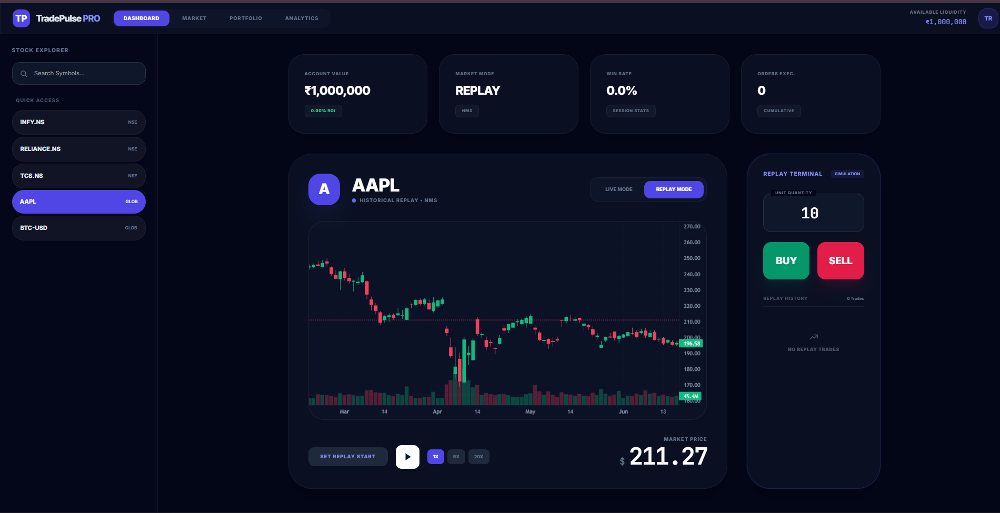
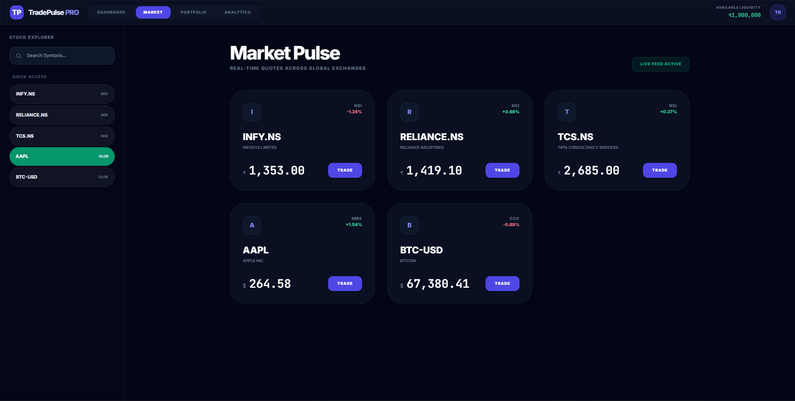
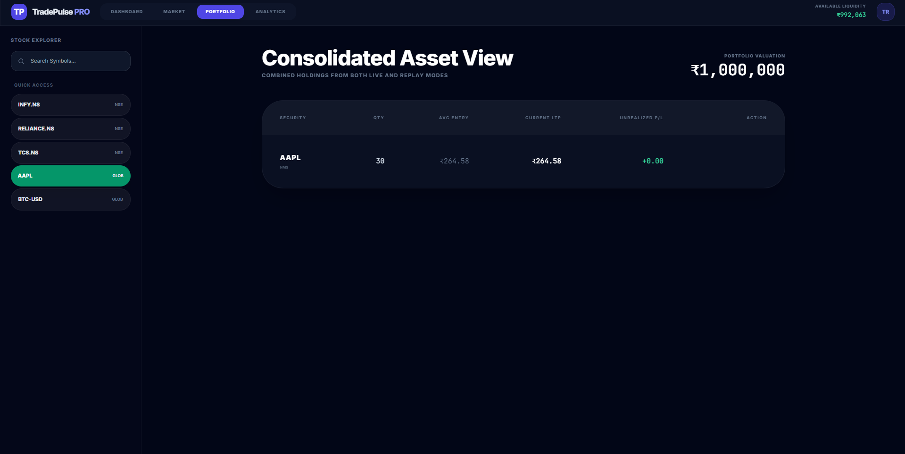
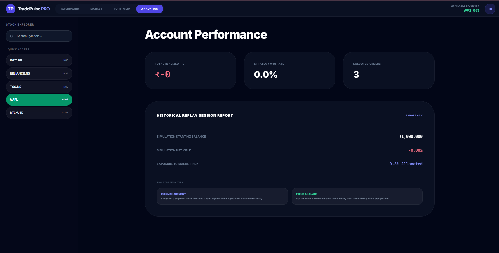

# TradePulse Pro | Advanced Paper Trading Platform

TradePulse Pro is a high-performance, interactive paper trading environment designed for traders to master strategies using real-time market data and historical price action. Built with a professional, production-level architecture for high-speed execution and seamless deployment.

## Live Demo Video Link 

https://drive.google.com/file/d/1CS1SUPDg6vplNzsNKoxqs4EwP4PHiPD9/view?usp=sharing

## 📸 Screenshots

### Screenshot 1


### Screenshot 2


### Screenshot 3


### Screenshot 4


### Screenshot 5



##LIVE DEMO
https://paper-trade-x-git-main-neha-dhattarwals-projects.vercel.app/

## 🚀 Key Features

- **Live Market Mode**: Real-time quote streaming via WebSockets (Socket.io) for global equities and cryptocurrencies.
- **Historical Market Replay**:
  - Load up to 2 years of daily OHLC data.
  - "Bar-by-Bar" sequential playback with adjustable speeds (1x, 5x, 20x).
- **Professional Analytics**:
  - Real-time ROI and Win Rate tracking.
  - CSV Export for trade history and session analysis.
- **Learning Support**: Inline strategy tips and risk management guidance.

## 🛠 Project Architecture

The project follows a **Modular Service-Oriented Architecture** designed for independent scaling and hosting.

- **Frontend**: React 19 + TypeScript + Vite. Optimized for **Vercel**.
- **Backend**: Node.js + Express + TypeScript + Socket.io. Optimized for **Render**.
- **Database**: MongoDB (User profiles, Trade persistence, Mode-specific balances).
- **Real-time Layer**: Socket.io for low-latency quote streaming.

## 💻 Local Development Setup

### 1. Initial Setup
Install dependencies for all services at once from the root directory:
```bash
npm run install:all
```

### 2. Configuration
- **Backend**: Create `backend/.env`
  ```env
  PORT=5000
  MONGO_URI=your_mongodb_uri
  JWT_SECRET=your_secret
  NODE_ENV=development
  ```
- **Frontend**: Create `frontend/.env`
  ```env
  VITE_API_URL=http://localhost:5000
  ```

### 3. Run Locally
Use the root orchestrator to start services:
- **Backend**: `npm run dev:backend`
- **Frontend**: `npm run dev:frontend`

## 📂 Project Structure

```text
├── frontend/                # React Application (Client)
│   ├── src/                 # Source code
│   └── package.json         # Frontend-specific dependencies
├── backend/                 # Node.js API (Server)
│   ├── src/                 # Source code
│   └── package.json         # Backend-specific dependencies
├── package.json             # Root orchestrator & workspace scripts
└── DEPLOYMENT.md            # Detailed hosting guide for Vercel/Render
```

## 📈 Deployment

Ready to go live? Refer to our [Detailed Deployment Guide](./DEPLOYMENT.md) for step-by-step instructions on hosting the frontend on Vercel and the backend on Render.

---
*Built for educational purposes. Not intended for actual financial advice.*
